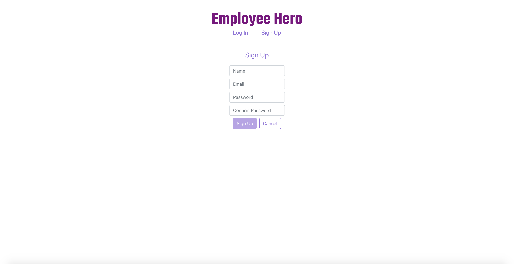
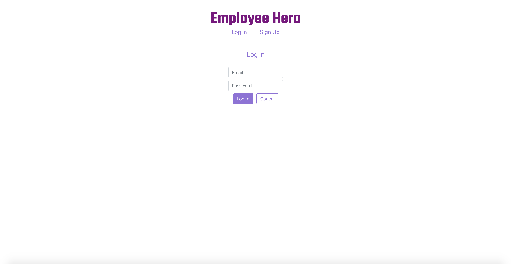
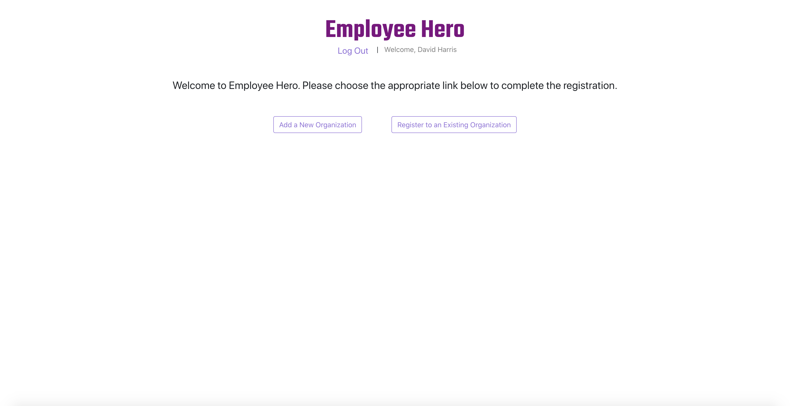
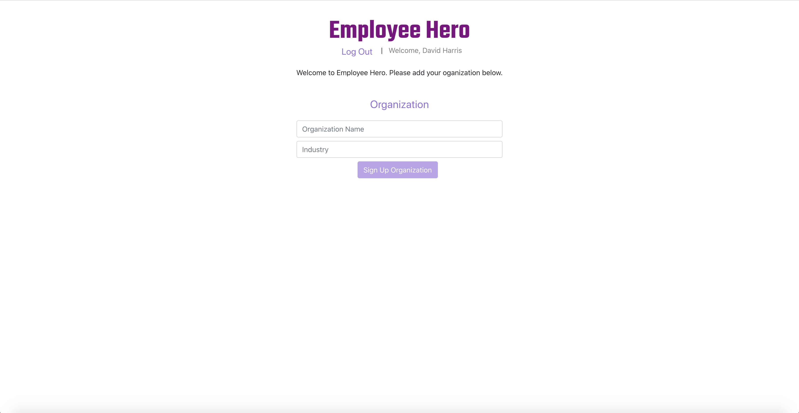
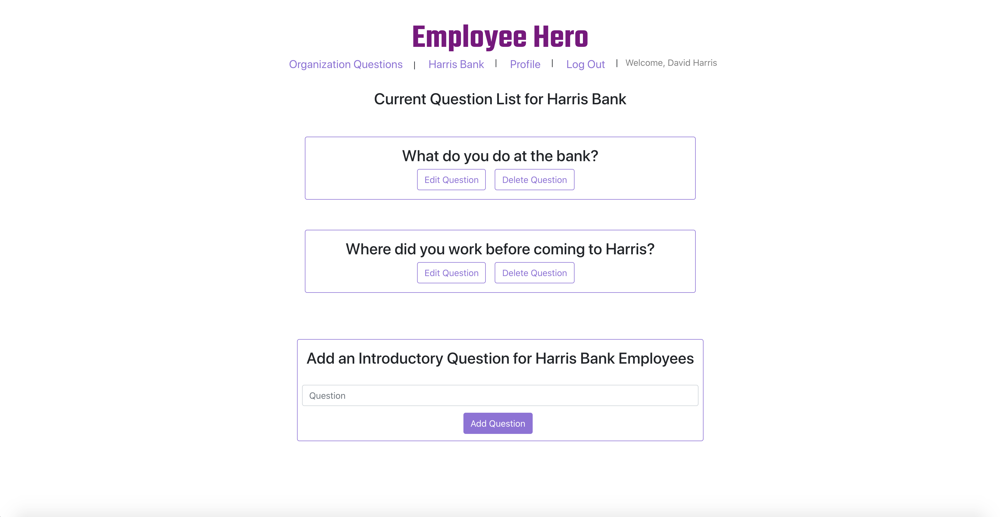
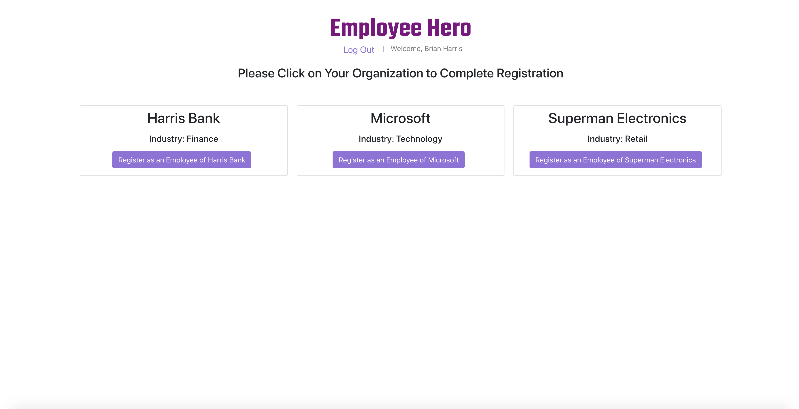
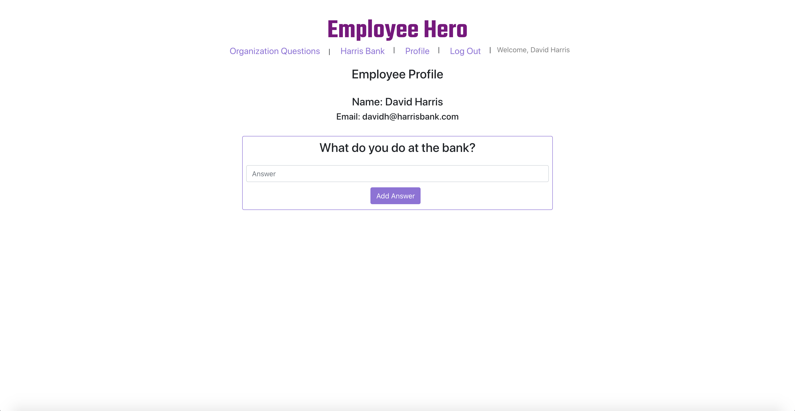
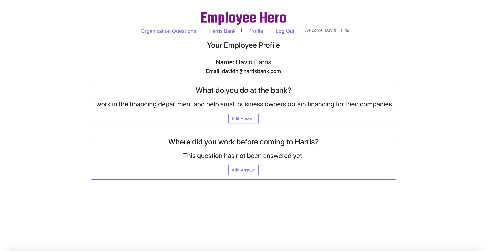
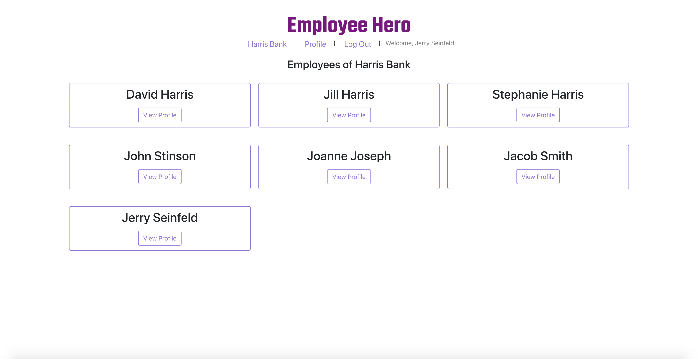
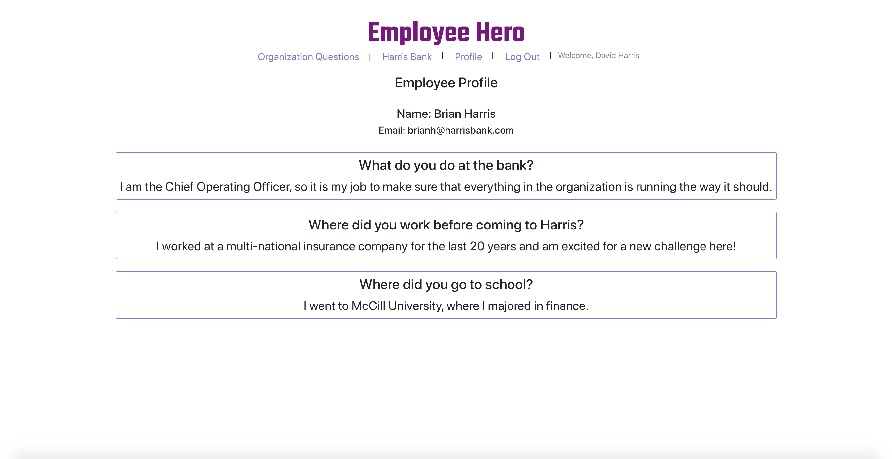

# Employee Hero

Employee Hero is an HR Tool that allows an employees to learn more about their co-workers. The software lets organizations ask customized questions to their employees, while employees can answer questions and view answers their co-workers have given. The goal of the software is to provide more of an introduction to a colleague's background then you might normally have the chance to get (especially so in a remote work environment!)

---

## Author

David Harris

---

## Getting Started

https://employee-hero.herokuapp.com/

Sign up and register your organization to get started. You can then add questions you'd like to ask your employees. Employees can sign up and join the registered company, answer questions and view their co-workers profiles!

[Project Planning via Notion](https://www.notion.so/e21c1a2903ad4b74a97a1af8bb113341?v=4fae65553ab7420c9e132e8e5b0ac62c)

---

## Screenshots

### Landing Page

## 

### Sign Up

## 

### Log In

## 

### Sign Up a New Organization or Register for your Existing Organization

## 

### Organization Sign Up

## 

### Adding Organization Questions

## 

### Employee Registering For a Company

## 

### Employee Answering Organization Question

## 

### Personal Profile

## 

### Employee List

## 

### Employee Profile

## 

---

## Technologies Used

- Deployed on Heroku
- Styled with Bootstrap
- Database hosted on MongoDB Atlas Database
- Express
- React
- JavaScript

---

## Next Steps

1. **Employee to Employee Communication:** Allowing co-workers to comment on each others answers or ask each other questions directly could improve the use case of the application.

2. **Answering Profile Questions:** When a user initially signs in, they should be able to answer all question using one submit button, as opposed to having to answer each question separately like they do in the current version.

3. **Delete Employees:** An Admin Employee should be able to delete employees who are no longer with the organization.

4. **Profile Picture:** Allowing a user to upload a profile picture would help improve the applications interface.
